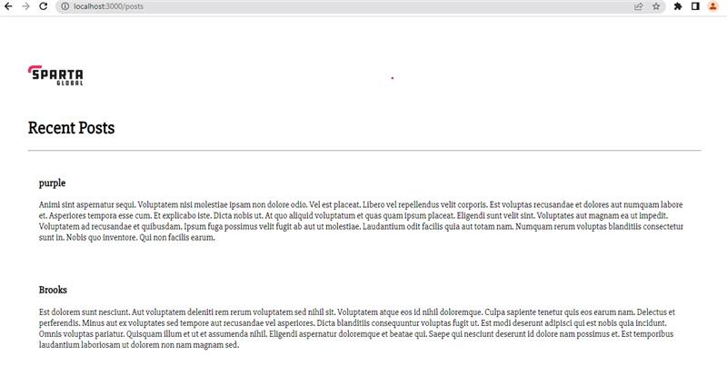

# Using docker

## Common commands 
- docker build -t `username`/`repo-name` .: Build an image from a Dockerfile.
- docker run -p: Run a container and connect to a specific port.
- docker ps: Show running containers.
- docker stop `container-id`: Stop a container.
- docker start `container-id`: Start an existing container.
- docker rm `container-id`: Remove an existing container.
- docker images: List installed images.
- docker pull: Pull an image from DockerHub.
- docker push `username`/`repo-name`:`tag-name`: Push to DockerHub.
- docker logs `container-id`: Show container logs in detached mode.
- docker exec -it `container-id` sh: SSH into a container.
- docker cp `file.name` `containerid`:`path`/`file.name`: Copy a file into a container.
- docker commit `container-id` `username`/`name`:`tag`: Commit a new version.
- docker rm `image-name` -f: Remove an image forcefully.
- alias docker="winpty docker": Fix Windows bug for Docker language.

## Edit nginx
- we can run docker with:
```
docker run -d -p 80:80 nginx
alias docker="winpty docker"
docker exec -it <container id> sh
```
- You can then edit the nginx html file in here.

## Custom Docker with nginx
- Make sure to login to docker with:
```
docker login
```
- Make a directory for the Docker file: 
```
mkdir jamie-tech230
```
- In here, we create a html file:
```
nano index.html
```
Any info I want to display can be added here.
- I next make a Docker file:
```
nano Dockerfile
```
- In here, the following commands are added:
``` 
FROM nginx
LABEL MAINTAINER=Jamie-sparta
COPY index.html /usr/share/nginx/html/
EXPOSE 80
CMD ["nginx","-g","daemon off;"]
```
- We can the run the commands:
``` 
docker build -t jamie-tech230-nginx/tech230-jamie .
docker run -d -p 80:80 jamie-tech230-nginx/tech230-jamie
docker push jamie-tech230-nginx/tech230-jamie
```
where `jamie-tech230-nginx` is the repo name on dockerhub.
- Note: Port 80 must be free in order for it to run.

## MongoDB version 4
- In a Dockerfile, add:
```
From mongo:4.4
Expose 27017
CMD ["mongod"]
```
- We then need to build this, and then push it to Docker hub.

## Setting up node
- To install node, we make another Dockerfile:
```
FROM node:16
LABEL MAINTAINER=Esther@Sparta
WORKDIR /app
COPY app .
EXPOSE 3000
RUN npm install
CMD ["npm", "start", "daemon off;"]
```
- This can then be built and pushed to Docker hub

## Composing the two together
- In order for the app to talk to the database, they must be connected.
- This is done by composing the two.
- We enter the command `nano docker-compose.yml` as this will be done in Yaml.
- The following commands are then added:
```
version: '3.1'
services:
  app:
    image: jamiegodwin1/jamie-tech230-nginx:node
    restart: always
    ports:
      - 3000:3000
    depends_on:
      - database
    environment:
      - DB_HOST=database:27017/posts
    command:
      sh -c "npm install && npm start"
  database:
    image: jamiegodwin1/mongodb4:latest
    restart: always
    ports:
      - 27017:27017
```
- The command `docker compose up`
- It should look like this:

