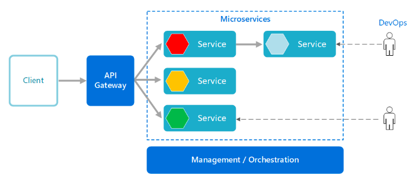

## What is a micro services architecture?
- An application is built as a collection of small, loosly coupled services that can be independantly developed, deployed and scaled
- Each microservice focuses on a specific buisness capability and communicates with other services through API's.
- They can be used break down complex applications, scale individual services and for continuous integration, deployment and delivery. 

## Who uses it in the industry?
- Netflix use it instead of monolith to handle specific tasks like reccomendations, authentification and streaming. 
- Amazon use it for services like AWS, prime and marketplace. 

## Why should we use it?
- Scalability
- Flexibility
- Fault isolation
- Reusability
- Continuous deployment 

## When not to use it?
- Small and simple applications 
- Minimal scalability requirement 
- Strong reliance on interdependancies could introduce unnessecary complexity. 

## Microservice vs 2Tier vs Monolith 
- In monolith, the whole architecture is built as a single unit where all components are connected.
- It's easiar to initially develop, but as it grows it becomes harder to maintane.
- Microservices turns it into smaller, more loosly connected services that can be worked on independantly

- Two-tier consists of a client-tier and a server-tier
- Microservices goes beyond this by having even smaller parts. This allows for each part to handle specific tasks, and communicate with eachother when needed. 

## What is docker?
Docker is a tool that simplifies the deployment and management of applications by packaging them into self-contained units called containers. These containers include everything needed to run the application, making it easy to move and run the application consistently across different environments. 

## Common examples
- App deployment
- Microservices architecture
- Continuous integration/deployment
- Development environments

## What is K8?
- It's an open-source container orchestration platform. It automates the deployment, scaling and management across multiple different clusters.

## Why should we use it?
- It provides a unified platform to deploy, scale and manage containers, allowing you to focus more on developing your application than worrying about the infastructure. 
- They allow for easy scaling, as auto-scaling can be enabled, removing the manual work.
- It distributes work across multiple nodes, so if one node fails, K8 can automatically redistribute the workload. This gives increased availability. 
- It can automatically replace containers that aren't working properly.

## K8 cluster
- It refers to a group of computers (nodes) that work together to run containerised applications, like we did in Docker.

## K8 Objects
- Pods: They encapsulate one or more containers, along with shared resources and namespaces.
- Deployments: They're used to manage the lifecycle of pods. It ensures a certain number of pod replicas are running at all times. 
- Namespaces: Used to create virtual clusters with a physical cluster, giving separation, access control and resource management. 
- ConfigMaps and secrets: They store configuration data that can be consumed by containers within pods. The secrets are used to store sensitive info, like passwords.

## K8 services
Services provide a stable network endpoint that allows other pods or external clients to access the pods running in your cluster

- Load balancing: Requests distributed equally amongst each pod available. 
- Service Discovery: They provide a way to discover and connect to pods dynamically. Pods can communicate with the service using their DNS names. 
- Cluster IP: Services are assigned an internal IP address called a cluster IP, which can only be accessed within the cluster. This allows for communication with the service.

## K8 deployments
- It's used to ensure that a specified number of replica pods are running and to handle updates of your application. It essentially maintanes the desired state of your application.

## K8 self healing
- It's the ability of the system to automatically detect and recover from failures or unhealthy states without manual intervention. 

## K8 auto-scaling
- It allows for the automatic adjustment of the number of running pods based on the current work demand. It allows for the efficient use of resources.

## K8 deploying microservices
- It provides scalability, reliability and flexibility to the apps infastructure.
1. Containerise using Docker
2. Set up K8 cluster
3. Define deployment
4. Deploy microservices
5. Scale and manage as needed
6. Expose the services using K8
7. Monitor and manage your cluster. 
